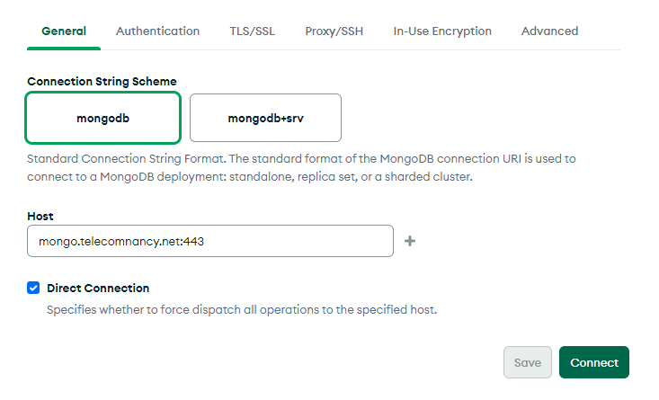
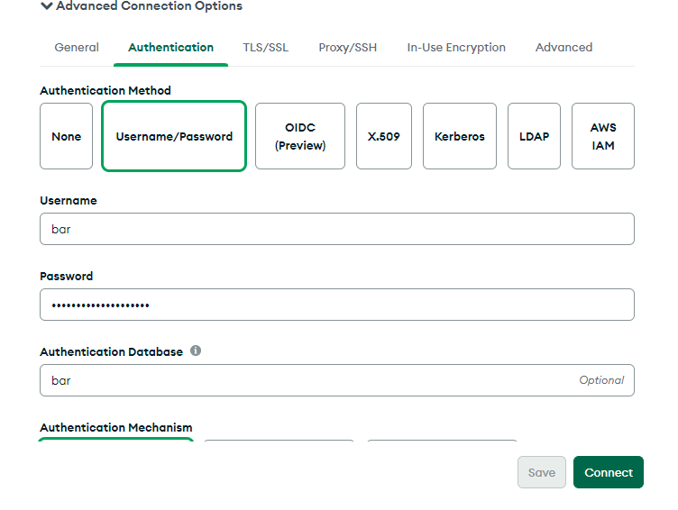
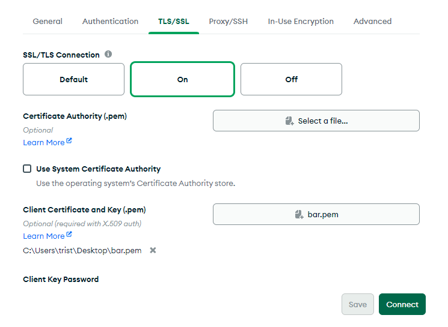

# MongoDB

La base de donnée est accessible via MongoDB-Compass. Lisez la
[documentation](https://www.mongodb.com/try/download/compass) pour
l'installation.\
Pour le reste, ajoutez une connextion, déroulez les paramètres avancés (et ne
touchez qu'à ces paramètres). 
 Le mot de passe se trouve dans le
vaulwarden du bar pour y accéder voir [ici](./vaultwarden.md)
 Le certificat se trouve sur le drive du bar, et
devra être copié dans le répertoire info d'année en année afin de ne pas se
perdre
